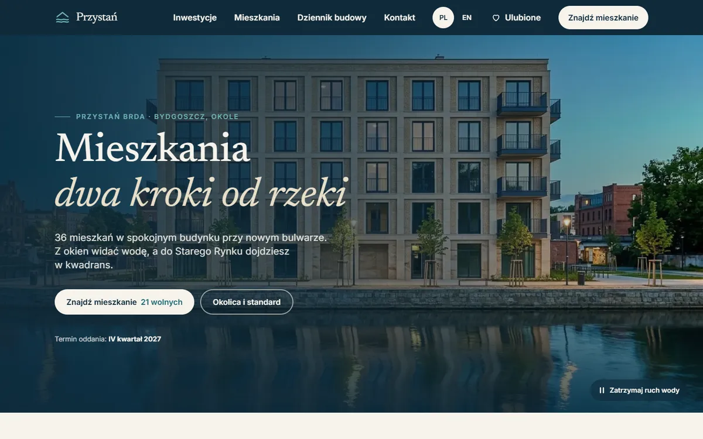
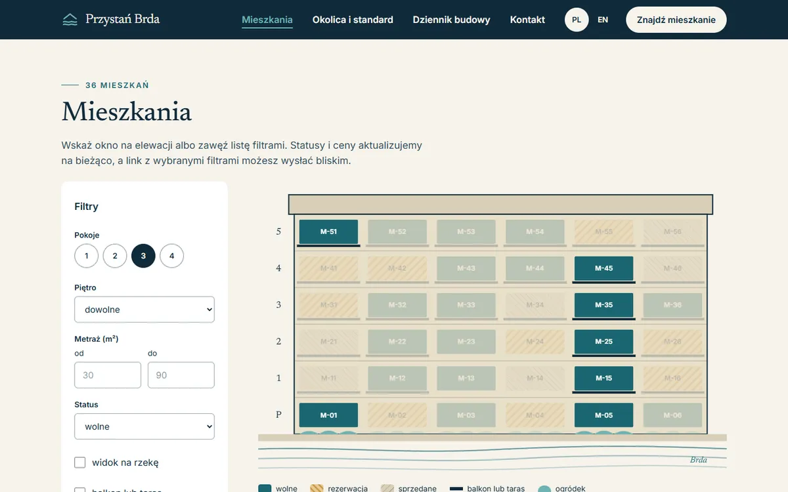
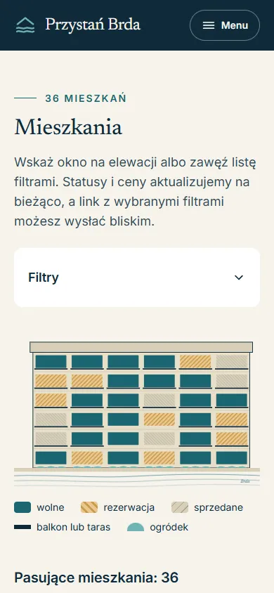

# Przystań Brda: strona inwestycji mieszkaniowej na WordPressie

**Demo:** https://przystan.sitebest.eu (PL) · https://przystan.sitebest.eu/en/ (EN)

Strona fikcyjnej inwestycji: 36 mieszkań nad rzeką w Bydgoszczy. Zbudowana jako projekt do portfolio,
żeby pokazać, jak robię strony na WordPressie bez page buildera: własny motyw, własna wtyczka, REST API,
wielojęzyczność, SEO techniczne, dostępność i bezpieczeństwo. Firma, ceny i dane kontaktowe są wymyślone
(strona ma `noindex` i notę „demo” w stopce).



## Co tu jest do zobaczenia

| Funkcja | Gdzie w kodzie |
|---|---|
| **Rysowana elewacja**: budynek w SVG generowany w PHP z danych WordPressa; każde okno to link do karty mieszkania z pełnym opisem dla czytników ekranu; kolor + wzór pokazują status | [`components/elewacja.blade.php`](web/app/themes/przystan/resources/views/components/elewacja.blade.php), [`app/Elewacja.php`](web/app/themes/przystan/app/Elewacja.php) |
| **Wyszukiwarka mieszkań** przez własny endpoint REST i `WP_Query` (`meta_query`), bez przeładowania strony; filtry w adresie URL; działa też bez JavaScriptu | [`Rest/MieszkaniaController.php`](web/app/plugins/przystan-core/src/Rest/MieszkaniaController.php), [`Mieszkania/Wyszukiwarka.php`](web/app/plugins/przystan-core/src/Mieszkania/Wyszukiwarka.php), [`modules/wyszukiwarka.js`](web/app/themes/przystan/resources/js/modules/wyszukiwarka.js) |
| **Formularz zapytania** z walidacją po stronie serwera, antyspamem bez CAPTCHA (pułapka, podpisany czas, limit IP) i wersją bez JS (`admin-post.php`) | [`Zapytania/`](web/app/plugins/przystan-core/src/Zapytania/) |
| **Webhook do CRM**: podpis HMAC-SHA256, wysyłka w tle przez WP-Cron, 3 ponowienia (1, 5, 30 min), stan i „Wyślij ponownie” w panelu | [`Webhook/`](web/app/plugins/przystan-core/src/Webhook/) |
| **Własny typ treści + ACF**: mieszkania z polami (piętro, metraż, status…), pola stron zapisane w kodzie (wersjonowane w git) | [`Mieszkania/`](web/app/plugins/przystan-core/src/Mieszkania/), [`Strony/Pola.php`](web/app/plugins/przystan-core/src/Strony/Pola.php) |
| **PL + EN (Polylang)**: tłumaczone treści, synchronizacja liczb i statusu między językami, osobne adresy (`/mieszkania/m-35/`, `/en/apartments/m35/`), pliki `.po/.mo` z poprawnymi polskimi formami liczby mnogiej | [`Polylang/Integracja.php`](web/app/plugins/przystan-core/src/Polylang/Integracja.php), [`languages/`](web/app/plugins/przystan-core/languages/) |
| **SEO techniczne bez wtyczki SEO**: tytuły, meta description, Open Graph, JSON-LD (`ApartmentComplex`, `Apartment` + `Offer`, `BlogPosting`, `BreadcrumbList`), mapa strony, hreflang | [`app/seo.php`](web/app/themes/przystan/app/seo.php) |
| **Bezpieczeństwo**: XML-RPC wyłączony, lista użytkowników w REST ukryta, brak wyliczania autorów, CSP i Permissions-Policy, escapowanie i nonce w kodzie, panel za Cloudflare | [`mu-plugins/przystan-bezpieczenstwo.php`](web/app/mu-plugins/przystan-bezpieczenstwo.php) |
| **Ustawienia inwestycji** na Settings API (bez płatnego ACF Pro): kontakt, termin, adres i klucz webhooka | [`Ustawienia/`](web/app/plugins/przystan-core/src/Ustawienia/) |

<p>
  
  
</p>

## Stos

- **[Bedrock](https://roots.io/bedrock/)**: WordPress przez Composer, konfiguracja w `.env`, katalog `web/` jako publiczny.
- **[Sage 11](https://roots.io/sage/)**: motyw z szablonami **Blade** (Acorn 6), **Tailwind CSS 4**, **Vite 8**.
- **ACF** (wersja darmowa), **Polylang**, własna wtyczka `przystan-core`.
- PHP 8.3, testy **Pest**, styl **Laravel Pint**, CI w **GitHub Actions**.
- Lokalnie SQLite (oficjalna wtyczka `sqlite-database-integration`, tylko w `require-dev`), na produkcji MySQL.
- Serwer: CloudPanel (nginx, PHP-FPM) za Cloudflare; zapora wpuszcza ruch HTTP tylko z adresów Cloudflare.

## Struktura

```
config/                          konfiguracja Bedrocka (application.php + środowiska)
web/app/plugins/przystan-core/   WTYCZKA: dane i logika (działa z dowolnym motywem)
  src/Mieszkania/                typ treści, pola ACF, wyszukiwarka (WP_Query), dane mieszkania
  src/Rest/                      endpointy REST: GET /mieszkania, POST /zapytania
  src/Zapytania/                 formularz: walidacja, antyspam, zapis, wersja bez JS
  src/Webhook/                   podpis HMAC i wysyłka z ponowieniami
  src/Ustawienia/, src/Strony/, src/Polylang/
  languages/                     .pot, en_GB, pl_PL
web/app/themes/przystan/         MOTYW: tylko wygląd
  app/                           setup, SEO, composery widoków (dane dla Blade), geometria elewacji
  resources/views/               szablony Blade
  resources/js/modules/          menu, elewacja, wyszukiwarka, formularz (czysty JS, ~2 KB gzip)
  resources/css/app.css          system wizualny w Tailwind 4 (@theme)
web/app/mu-plugins/              hardening bezpieczeństwa
scripts/                         seed treści, wdrożenie, testy dymne, rzuty, tłumaczenia
tests/Unit/                      testy logiki wtyczki (Pest)
```

Zasada: **motyw = wygląd, wtyczka = dane**. Po zmianie motywu mieszkania, zapytania i webhook działają dalej.

## Uruchomienie lokalnie

Wymagane: PHP 8.3 (rozszerzenia `pdo_sqlite`, `intl`, `gd`), Composer, WP-CLI, Node 22.

```bash
git clone https://github.com/vtnu-dev/Przystan-Brda.git && cd Przystan-Brda
composer install
cp .env.example .env            # uzupełnij klucze: https://roots.io/salts.html
cd web/app/themes/przystan && composer install && npm ci && npm run build && cd -
wp core install --url=http://localhost:8810 --title="Przystań Brda" --admin_user=admin --admin_email=admin@przystan.test --prompt=admin_password
wp language core install pl_PL en_GB
wp plugin activate advanced-custom-fields polylang przystan-core && wp theme activate przystan
npm install && npm run rzuty     # rzuty mieszkań (SVG → WebP); zdjęcia są już w scripts/seed-media
wp eval-file scripts/seed.php   # strony, 36 mieszkań × 2 języki, dziennik budowy, menu, ustawienia
wp rewrite flush
wp server --port=8810
```

Testy i styl:

```bash
vendor/bin/pest                 # logika wtyczki: filtry, zapytanie WP_Query, walidator, podpis HMAC, antyspam
vendor/bin/pint --test          # styl kodu
scripts/check.sh                # testy dymne działającej strony (adresy, SEO, REST, nagłówki)
```

Test webhooka lokalnie: `PRZYSTAN_KLUCZ=<klucz z Ustawienia → Przystań Brda> php -S localhost:8899 scripts/odbiornik-webhooka.php`,
w ustawieniach adres `http://localhost:8899/`, potem `wp cron event run --due-now`. Odbiornik sprawdza podpis.

## Webhook: format

```http
POST <adres z ustawień>
Content-Type: application/json
X-Przystan-Event: zapytanie.utworzone
X-Przystan-Timestamp: 1791400000
X-Przystan-Signature: sha256=<HMAC-SHA256("timestamp.treść", klucz)>
```

```json
{ "zdarzenie": "zapytanie.utworzone", "id": 174, "jezyk": "pl",
  "klient": { "imie": "Jan", "email": "jan@example.com", "telefon": "600 100 200" },
  "wiadomosc": "…", "zgoda_rodo": "2026-10-07T10:39:42+00:00",
  "mieszkanie": { "numer": "M-35", "pietro": 3, "pokoje": 3, "metraz": 62.7, "cena": 662000, "status": "wolne", "url": "…" } }
```

Odbiorcą może być n8n, Make, Zapier albo endpoint CRM. Bez adresu zapytania tylko zapisują się w panelu.

## Wdrożenie

`scripts/deploy.sh`: build motywu lokalnie (serwer nie potrzebuje Node) → archiwum z `HEAD` + zbudowane zasoby →
`rsync --delete` do katalogu strony (bez `.env`, uploads i pakietów z Composera) → `composer install --no-dev`,
języki, cache widoków Blade, `rewrite flush`. WP-Cron uruchamia systemowy cron co minutę (`DISABLE_WP_CRON=true`).

## Decyzje i kompromisy

- **ACF bez wersji Pro.** Brak repeatera, więc powtarzalne elementy mają stałą liczbę miejsc (4 liczby, 3 atuty,
  6 punktów w okolicy). Dla jednej inwestycji to wystarcza i nie wymaga licencji. Ustawienia globalne są na Settings API.
- **Pola ACF w PHP, nie w bazie.** Grupy pól są w kodzie, więc są w git, w code review i identyczne na każdym środowisku.
- **Bez wtyczki SEO.** Kilkadziesiąt linii w `app/seo.php` daje to, czego ta strona potrzebuje, bez dodatkowych zapytań i ustawień.
- **Elewacja jako SVG z danych, nie zdjęcie z mapą obszarów.** Zmiana statusu w panelu od razu zmienia kolor okna,
  nie trzeba ręcznie obrysowywać okien, a każde okno jest dostępne z klawiatury.
- **Polylang zamiast WPML.** Darmowy, a kod nie zależy od wtyczki: ciągi przez `__()` + `.po/.mo`,
  integracja w jednej klasie. Darmowy Polylang nie tłumaczy sluga typu treści, więc `/en/apartments/` to własna reguła rewrite.
- **Formatowanie liczb we wtyczce.** Ceny i metraże formatuje wtyczka według języka strony (PL „670 000 zł”, EN „670,000 zł”).

## Jakość

- **Lighthouse (telefon):** dostępność 100, dobre praktyki 100, SEO 100 z wyjątkiem celowego `noindex`.
  Wydajność na produkcji: zob. sekcja niżej.
- **WCAG 2.2 AA:** kontrast sprawdzony dla każdej pary kolorów, skip link, widoczny fokus, etykiety i błędy pól
  powiązane przez `aria-describedby`, komunikaty w `aria-live`, status mieszkania kolorem i kształtem, cele dotykowe ≥ 24 px.
- **Wydajność:** fonty lokalnie (bez Google Fonts), WebP w kilku rozmiarach (`srcset`), hero z `fetchpriority="high"`,
  bez jQuery, emoji, oEmbed i stylów bloków poza wpisami, JS ~2 KB gzip, CSS ~13 KB gzip, zero zewnętrznych żądań.

## Moja rola

Projekt prowadzę od początku do końca: wybór koncepcji i wyglądu, architektura (podział motyw/wtyczka, REST, webhook),
treści PL/EN, konfiguracja serwera i wdrożenie. Pracuję z **Claude Code** jako narzędziem: ja decyduję, co i jak ma
powstać, sprawdzam każdą zmianę (testy, Lighthouse, ręczne testy w przeglądarce, z klawiatury i na telefonie)
i odpowiadam za wynik na produkcji. Zdjęcia wygenerowane w Google Flow, rzuty mieszkań generuje skrypt.

---

### English summary

A WordPress site for a fictional riverside apartment development, built to show custom WordPress work without
page builders: **Bedrock + Sage 11 (Blade, Tailwind 4, Vite)**, a custom plugin (custom post type + ACF fields
in code, REST search endpoint using `WP_Query`, enquiry form with HMAC-signed webhook and retries via WP-Cron,
Settings API page), **Polylang** (PL/EN), technical SEO without an SEO plugin (JSON-LD, Open Graph, hreflang,
sitemap), WCAG 2.2 AA and security hardening. The interactive facade is an SVG generated in PHP from WordPress data:
every window is a keyboard-accessible link to the apartment page. Built with Claude Code as a tool; I make the
decisions, review and test every change, and deploy.
